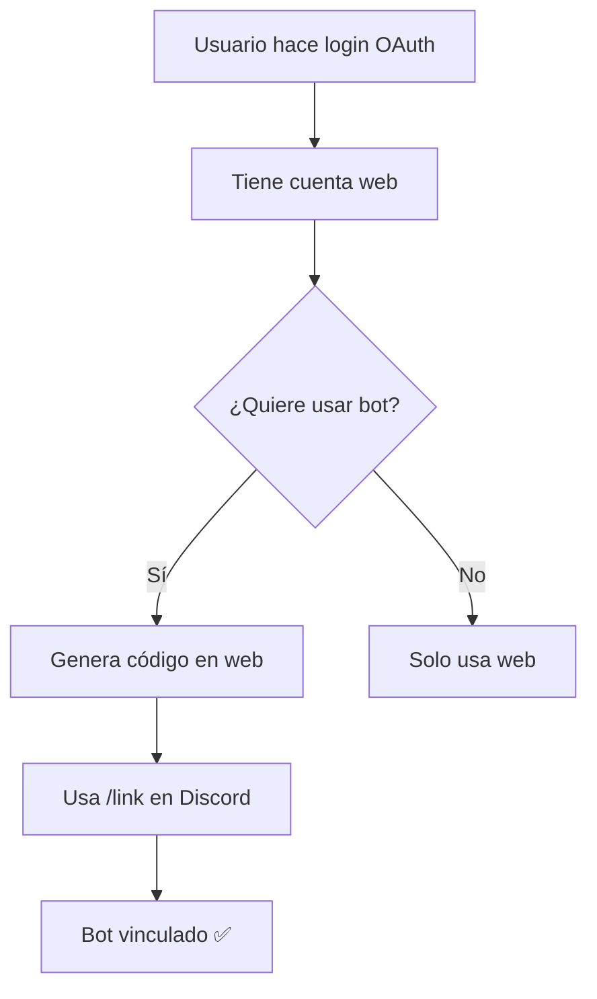

# Sistema de Vinculación con Discord

Este documento explica cómo funciona el sistema de vinculación entre la aplicación web y el bot de Discord.

## 🔑 Conceptos Clave

### Dos Sistemas Separados

La aplicación utiliza dos sistemas de autenticación con Discord:

| Sistema | Campo en DB | Propósito |
|---------|-------------|-----------|
| **OAuth Web** | `discordOAuthId` | Login en la aplicación web |
| **Bot Discord** | `discordId` | Comandos del bot en Discord |

**⚠️ IMPORTANTE**: Son sistemas independientes. Un usuario puede tener:
- ✅ Solo OAuth (puede usar web, NO puede usar bot)
- ✅ Solo Bot (puede usar bot, NO puede usar web)
- ✅ Ambos (puede usar web Y bot)

## 🔄 Flujo de Vinculación



### Paso a Paso

1. **Usuario hace login OAuth** → Tiene acceso a la aplicación web
2. **Usuario genera código de vinculación** → API devuelve código de 6 dígitos
3. **Usuario va a Discord y usa `/link CODIGO`** → Bot verifica el código
4. **Bot vincula `discordId`** → Usuario puede usar comandos en Discord

## 📦 Componentes Implementados

### 1. Hook: `useDiscordLink`

Hook personalizado para gestionar el estado de vinculación.

```typescript
import { useDiscordLink } from '@/hooks/useDiscordLink';

const { linkStatus, loading, error, refetch } = useDiscordLink();

// linkStatus.hasOAuth - true si tiene login web
// linkStatus.hasBot - true si tiene bot vinculado
// linkStatus.discordUsername - nombre de usuario
```

### 2. Componente: `DiscordLinkCard`

Componente para generar códigos de vinculación con:
- Generación de código de 6 dígitos
- Countdown timer de expiración
- Instrucciones paso a paso
- Auto-refresh mediante polling (cada 5 segundos)
- Botón de copiar código

```typescript
import { DiscordLinkCard } from '@/components/DiscordLinkCard';

<DiscordLinkCard onLinked={() => refetch()} />
```

### 3. Componente: `StatusBadge`

Badge reutilizable para mostrar estados.

```typescript
import { StatusBadge } from '@/components/StatusBadge';

<StatusBadge isLinked={linkStatus.hasBot} />
```

### 4. Página: `LinkDiscordPage`

Página completa con:
- Cards de estado (OAuth + Bot)
- Generación de códigos
- Desvinculación
- Lista de comandos disponibles

## 🛠️ API Endpoints

### GET `/api/v1/auth/me`

Obtiene información del usuario y estado de vinculación.

**Respuesta:**
```json
{
  "success": true,
  "user": {
    "id": "uuid",
    "email": "user@example.com",
    "discordLinked": false,
    "discordUsername": "username",
    "discordDiscriminator": "1234",
    "discordAvatar": "avatar_hash",
    "discordOAuthId": "oauth_id",
    "discordId": null,
    "createdAt": "2024-01-01T00:00:00.000Z",
    "lastLogin": "2024-01-02T00:00:00.000Z"
  },
  "stats": {
    "activeSessions": 1
  }
}
```

### POST `/api/v1/auth/link/generate`

Genera un código de vinculación para el bot.

**Respuesta:**
```json
{
  "success": true,
  "code": "ABC123",
  "expiresAt": "2024-01-01T00:10:00.000Z",
  "expiresIn": 600
}
```

**Errores:**
- `400`: Usuario ya tiene bot vinculado
- `401`: Usuario no autenticado

### POST `/api/v1/auth/link/unlink`

Desvincula el bot de Discord.

**Respuesta:**
```json
{
  "success": true,
  "message": "Bot desvinculado exitosamente"
}
```

## 🎨 Características de UX

### 1. Auto-refresh con Polling

El componente `DiscordLinkCard` hace polling cada 5 segundos para detectar cuando el usuario completa la vinculación en Discord, actualizando automáticamente el estado.

### 2. Countdown Timer

Muestra el tiempo restante hasta que expire el código (generalmente 10 minutos).

### 3. Instrucciones Visuales

Pasos numerados y claros:
1. Abre Discord
2. Ve al servidor del bot
3. Escribe: `/link CODIGO`
4. ¡Listo!

### 4. Estado Visual

- Cards separadas para OAuth y Bot
- Badges de estado (✅ Vinculado / ❌ No vinculado)
- Colores distintivos (verde = éxito, rojo = no vinculado)

### 5. Mensajes de Error

Mensajes claros cuando:
- No se puede generar código
- Error al desvincular
- Código expirado

## 📝 Tipos TypeScript

### `LinkStatus`
```typescript
interface LinkStatus {
  hasOAuth: boolean;      // Tiene login web
  hasBot: boolean;        // Tiene bot vinculado
  discordUsername?: string;
  discordDiscriminator?: string;
  discordAvatar?: string;
}
```

### `DiscordLinkCodeResponse`
```typescript
interface DiscordLinkCodeResponse {
  success: boolean;
  code: string;
  expiresAt: string;
  expiresIn: number;
}
```

## 🔒 Seguridad

1. **Códigos de un solo uso**: Cada código solo puede usarse una vez
2. **Expiración**: Los códigos expiran después de 10 minutos
3. **Autenticación requerida**: Solo usuarios autenticados pueden generar códigos
4. **Verificación en backend**: El bot verifica el código con el backend antes de vincular

## ✅ Checklist de Implementación

- [x] Tipos actualizados en `api.ts`
- [x] Hook `useDiscordLink`
- [x] Componente `DiscordLinkCard`
- [x] Componente `StatusBadge`
- [x] Página `LinkDiscordPage` actualizada
- [x] Estilos SCSS
- [x] Auto-refresh con polling
- [x] Countdown timer
- [x] Manejo de errores
- [x] Documentación

## 📚 Uso

### En la aplicación

1. Usuario hace login con Discord OAuth
2. Va a la página de configuración
3. Ve el estado de vinculación (OAuth + Bot)
4. Si el bot no está vinculado, genera un código
5. Va a Discord y usa `/link CODIGO`
6. La página se actualiza automáticamente mostrando el bot vinculado

### Desvinculación

1. Usuario hace clic en "Desvincular Bot"
2. Confirma la acción
3. El bot se desvincula
4. Pierde acceso a comandos de Discord (mantiene login web)

## 🐛 Solución de Problemas

### El código no funciona
- Verificar que no haya expirado
- Generar un nuevo código
- Verificar que el bot esté en el servidor correcto

### Auto-refresh no funciona
- Verificar que el polling esté activo
- Revisar la consola por errores de red
- Actualizar manualmente la página

### Error al generar código
- Verificar que el usuario esté autenticado
- Verificar que no tenga ya un bot vinculado
- Revisar logs del backend
